# 🚀 Dockerized Applications – Flask & Node.js

This project demonstrates how to containerize both a **Flask** and a **Node.js** application using Docker.

It covers:

- Creating Dockerfiles
- Building Docker images
- Running containers
- Port mapping
- Testing via terminal & browser
- Tagging images
- Pushing images to DockerHub
- Container cleanup

---

# 📁 Project Structure

```
.
├── images/
│   ├── 1.png
│   ├── 2.png
│   ├── ...
│   ├── 31.png
├── README.md
```

- **Flask Steps:** Images `1.png` to `19.png`
- **Node.js Steps:** Images `20.png` to `31.png`

---

# 🐍 Flask Docker Setup (Images 1–19)

---

## 🔹 Step 1 – Create Project Directory

```bash
mkdir my-flask-app
cd my-flask-app
```

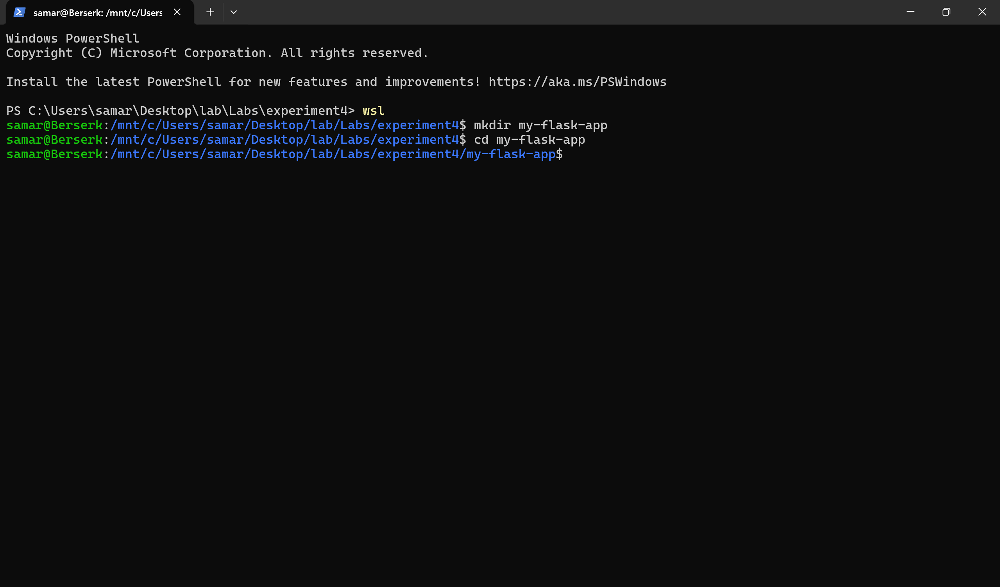

---

## 🔹 Step 2 – Create app.py

```python
from flask import Flask
app = Flask(__name__)

@app.route('/')
def hello():
    return "Hello from Docker!"

@app.route('/health')
def health():
    return "OK"

if __name__ == '__main__':
    app.run(host='0.0.0.0', port=5000)
```

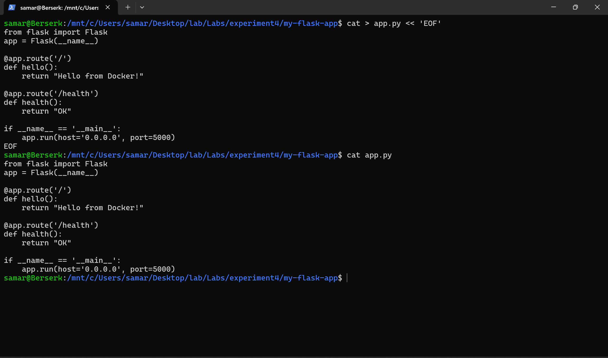

---

## 🔹 Step 3 – Create requirements.txt

```
Flask==2.3.3
```

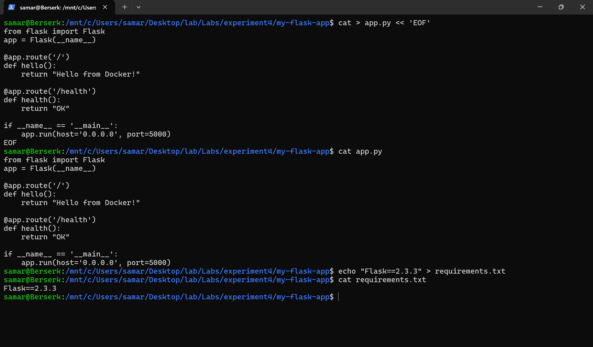

---

## 🔹 Step 4 – Create Dockerfile

```dockerfile
FROM python:3.9-slim

WORKDIR /app

COPY requirements.txt .
RUN pip install --no-cache-dir -r requirements.txt

COPY app.py .

EXPOSE 5000

CMD ["python", "app.py"]
```

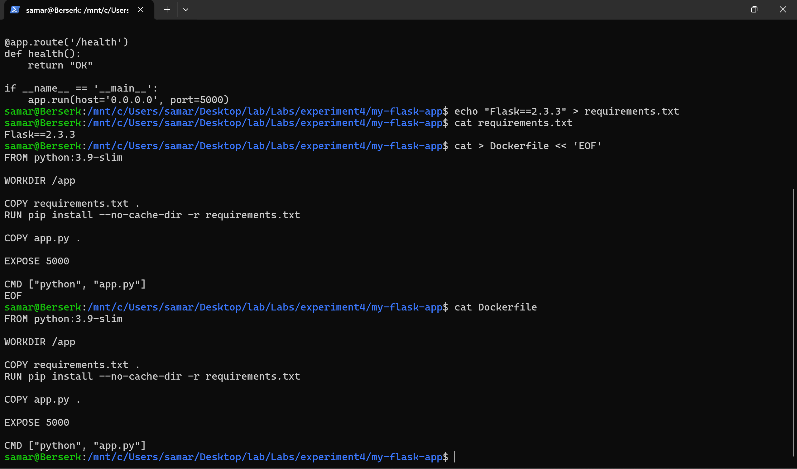

---

## 🔹 Step 5 – Build Docker Image

```bash
docker build -t my-flask-app .
```

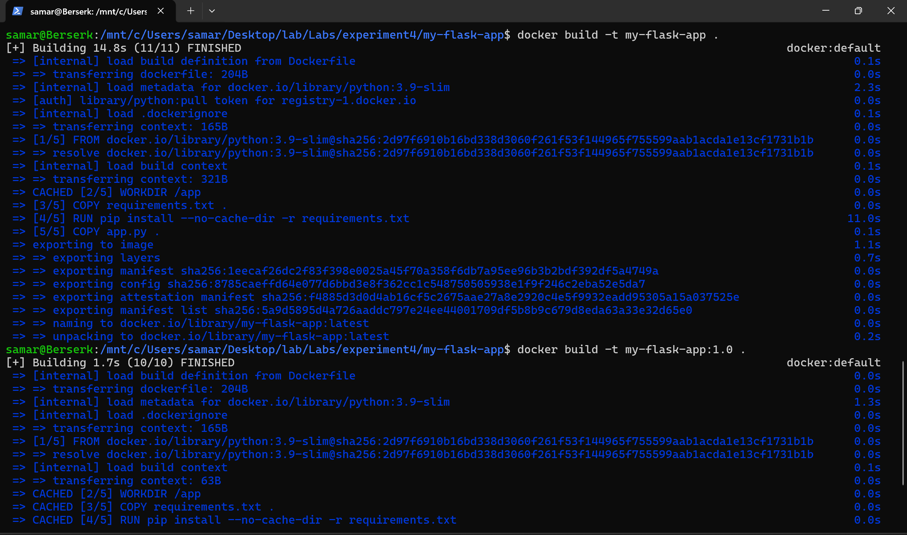

---

## 🔹 Step 6 – Run Container

```bash
docker run -d -p 5000:5000 --name flask-container my-flask-app
```

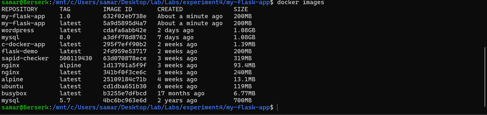

---

## 🔹 Step 7 – Test Application

```bash
curl http://localhost:5000
curl http://localhost:5000/health
```

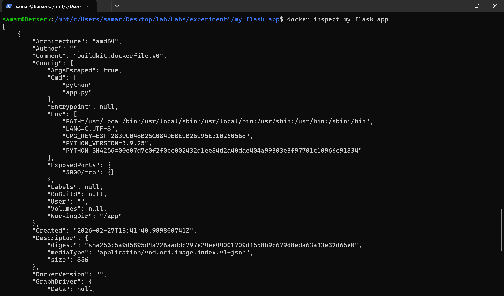

---

# 🟢 Node.js Docker Setup (Images 20–31)

---

## 🔹 Step 1 – Create Project Directory

```bash
mkdir my-node-app
cd my-node-app
```

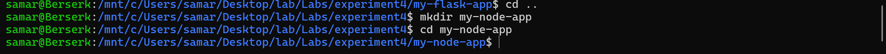

---

## 🔹 Step 2 – Create app.js

```javascript
const express = require("express");
const app = express();
const port = 3000;

app.get("/", (req, res) => {
  res.send("Hello from Node.js Docker!");
});

app.get("/health", (req, res) => {
  res.json({ status: "healthy" });
});

app.listen(port, () => {
  console.log(`Server running on port ${port}`);
});
```

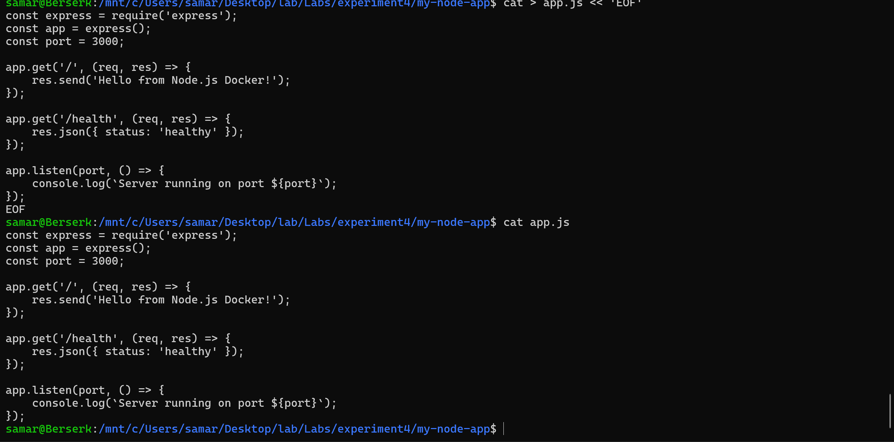

---

## 🔹 Step 3 – Create package.json

```json
{
  "name": "node-docker-app",
  "version": "1.0.0",
  "main": "app.js",
  "dependencies": {
    "express": "^4.18.2"
  }
}
```

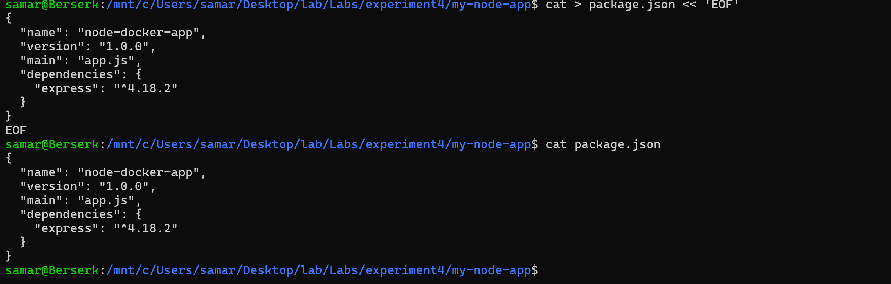

---

## 🔹 Step 4 – Create Dockerfile

```dockerfile
FROM node:18-alpine

WORKDIR /app

COPY package*.json ./
RUN npm install --only=production

COPY app.js .

EXPOSE 3000

CMD ["node", "app.js"]
```

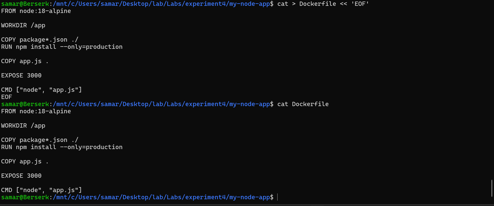

---

## 🔹 Step 5 – Build Docker Image

```bash
docker build -t my-node-app .
```

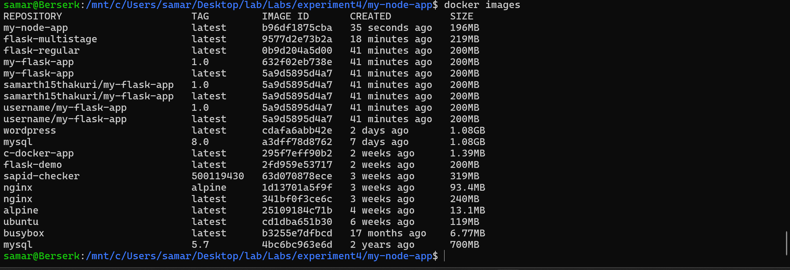

---

## 🔹 Step 6 – Run Container

```bash
docker run -d -p 3000:3000 --name node-container my-node-app
```

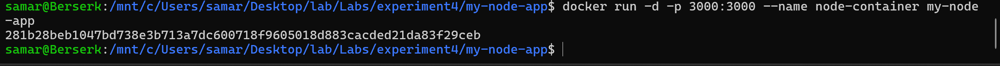

---

## 🔹 Step 7 – Test Application

```bash
curl http://localhost:3000
curl http://localhost:3000/health
```

Open in browser:

```
http://localhost:3000
```

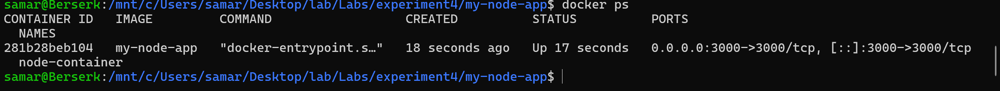

---

# 🐳 DockerHub – Publishing Images

---

## 🔹 Login to DockerHub

```bash
docker login
```

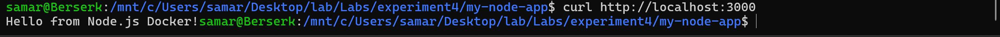

---

## 🔹 Tag Images

Replace `yourusername` with your DockerHub username.

```bash
docker tag my-node-app yourusername/my-node-app:1.0
docker tag my-flask-app yourusername/my-flask-app:1.0
```

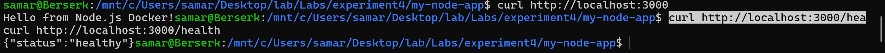

---

## 🔹 Push Images

```bash
docker push yourusername/my-node-app:1.0
docker push yourusername/my-flask-app:1.0
```

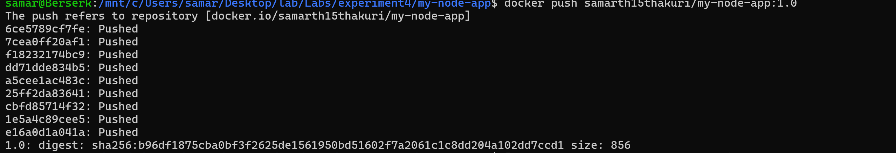

---

## 🔹 View on DockerHub

Visit:

https://hub.docker.com/

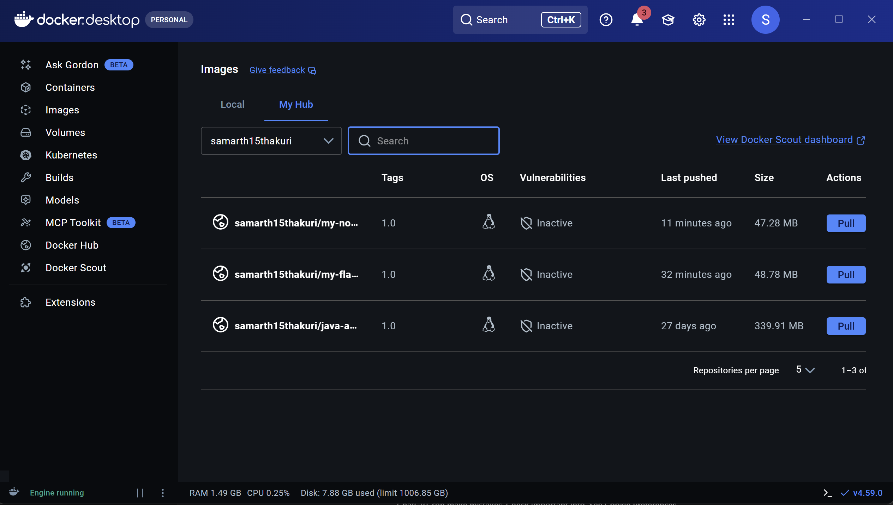

---

# 🧹 Cleanup Commands

Stop container:

```bash
docker stop container-name
```

Remove container:

```bash
docker rm container-name
```

Remove unused images:

```bash
docker image prune
```

Remove everything unused:

```bash
docker system prune -a
```

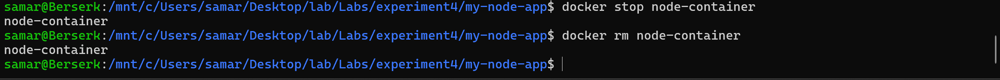

---

# 🎯 What This Project Demonstrates

- Docker image creation
- Container lifecycle management
- Port mapping
- Image tagging & versioning
- Publishing images to DockerHub
- Basic DevOps workflow
- Running microservices locally

---

# 👨‍💻 Author

Docker Practice Project – Flask & Node.js  
DevOps & Containerization Learning 🚀
