# Project Title

A brief description of what this project does and who it's for

# 🐳 Docker Run vs Docker Compose Lab

## 📌 Objective

To understand the difference between Docker Run and Docker Compose and deploy single & multi-container applications.

---

## ⚙️ Prerequisites

- Docker installed
- Docker Compose installed

---

# 🚀 Task 1: Single Container

## ▶ Docker Run

```bash
docker run -d --name lab-nginx -p 8081:80 nginx:alpine
```

### 📸 Output Screenshot

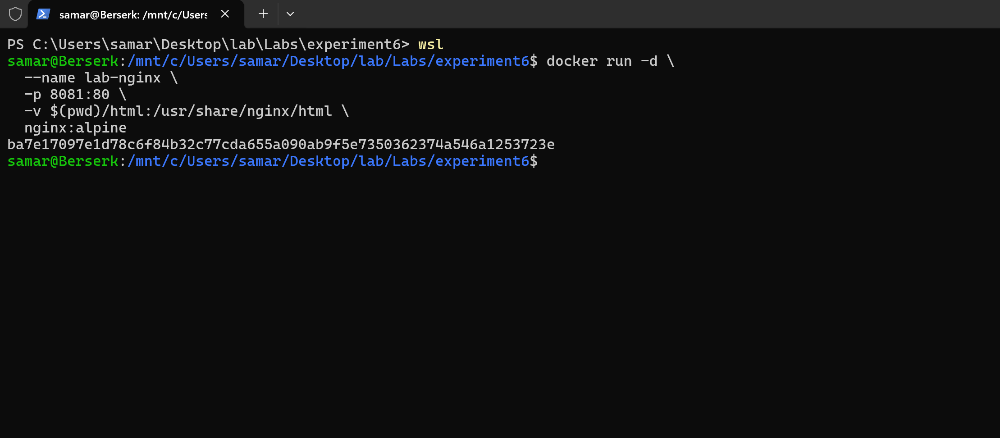
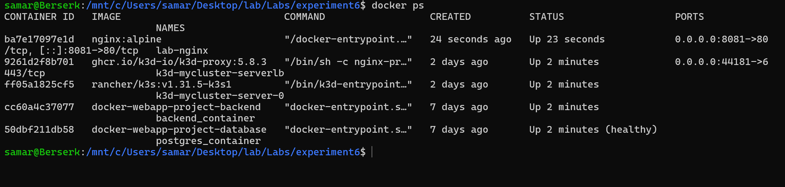
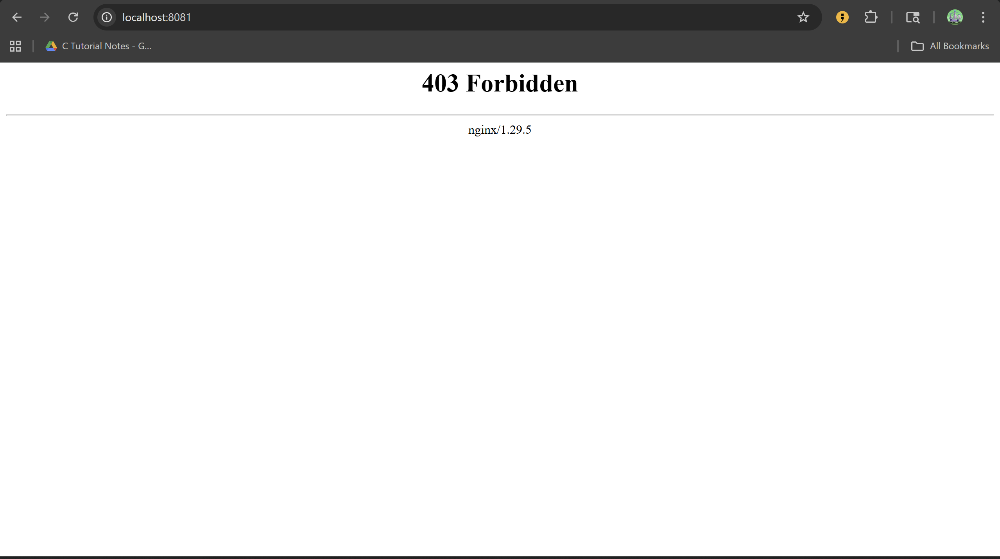
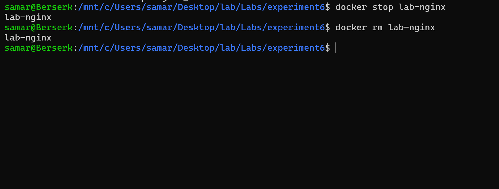

---

## ▶ Docker Compose

```yaml
version: "3.8"
services:
  nginx:
    image: nginx:alpine
    ports:
      - "8081:80"
```

```bash
docker compose up -d
```

### 📸 Output Screenshot

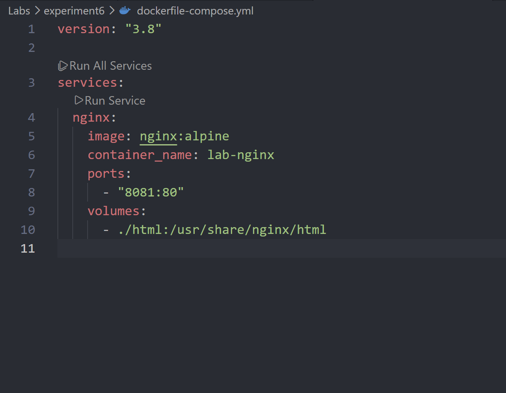
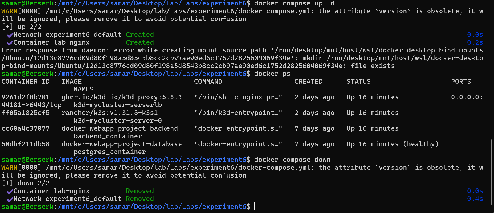
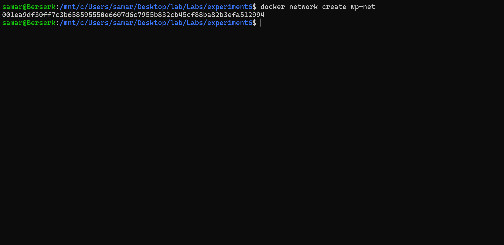
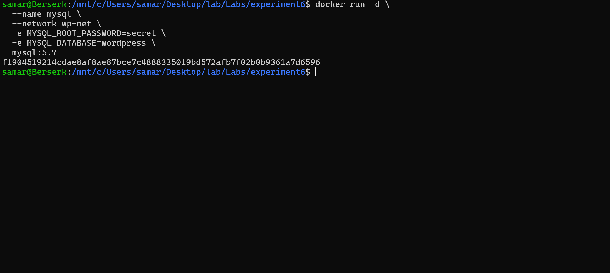
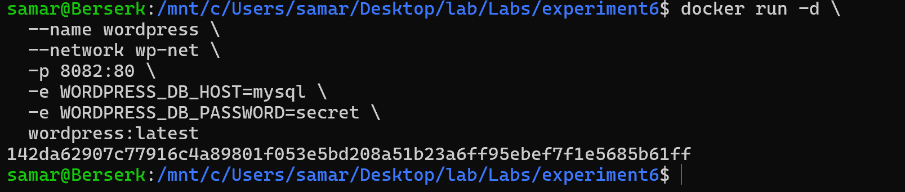
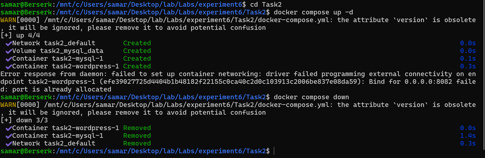

---

# 🌐 Task 2: Multi-Container (WordPress + MySQL)

## ▶ Docker Run Approach

### 📸 Screenshot

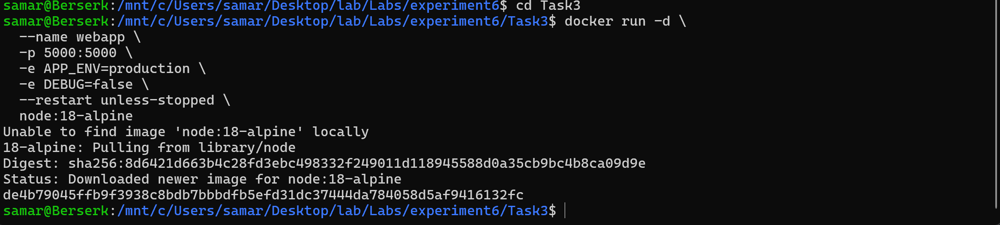

---

## ▶ Docker Compose Approach

```yaml
services:
  mysql:
    image: mysql:5.7

  wordpress:
    image: wordpress:latest
    ports:
      - "8082:80"
```

### 📸 Screenshot

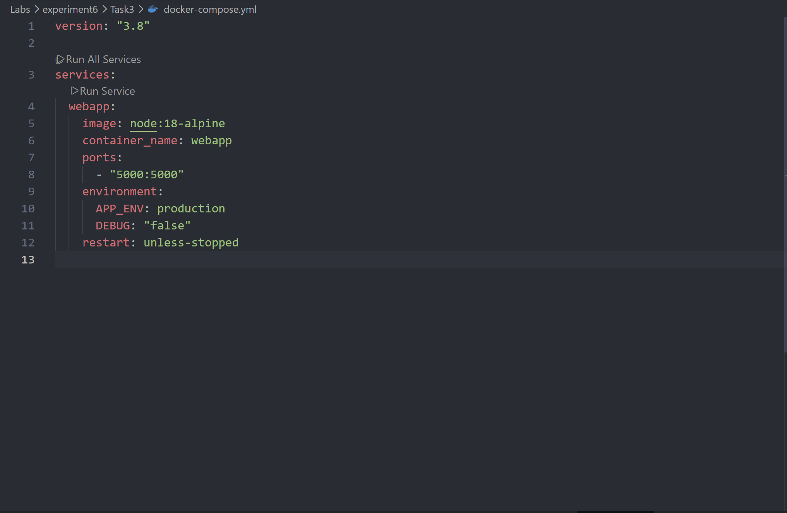

---

# 🔄 Task 3: Conversion

## Docker Run → Compose

### 📸 Screenshot


---

# 💾 Task 4: Volume + Network

### 📸 Screenshot


---

# 🏗️ Task 5: Dockerfile + Compose

## ▶ app.js

```javascript
// Node server
```

## ▶ Dockerfile

```dockerfile
FROM node:18-alpine
```

## ▶ Run

```bash
docker compose up --build -d
```

### 📸 Screenshot

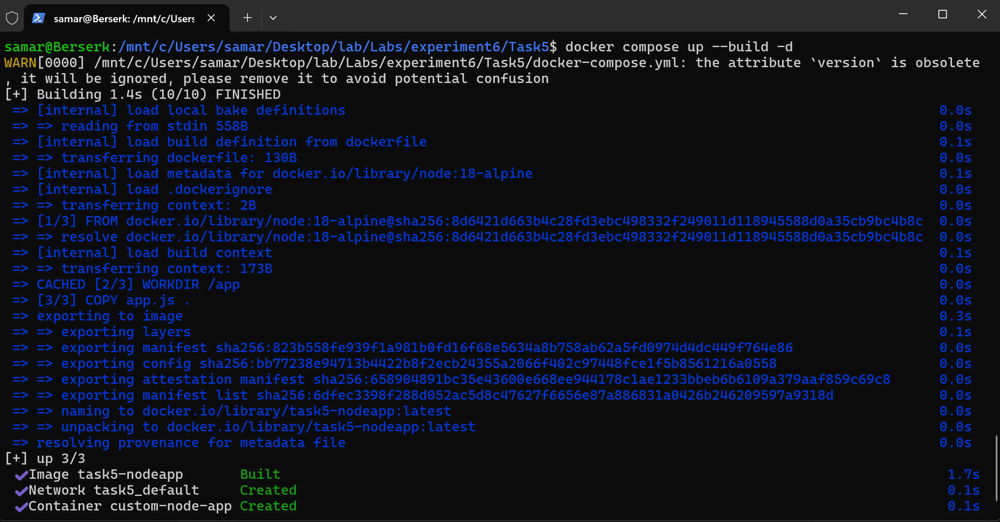
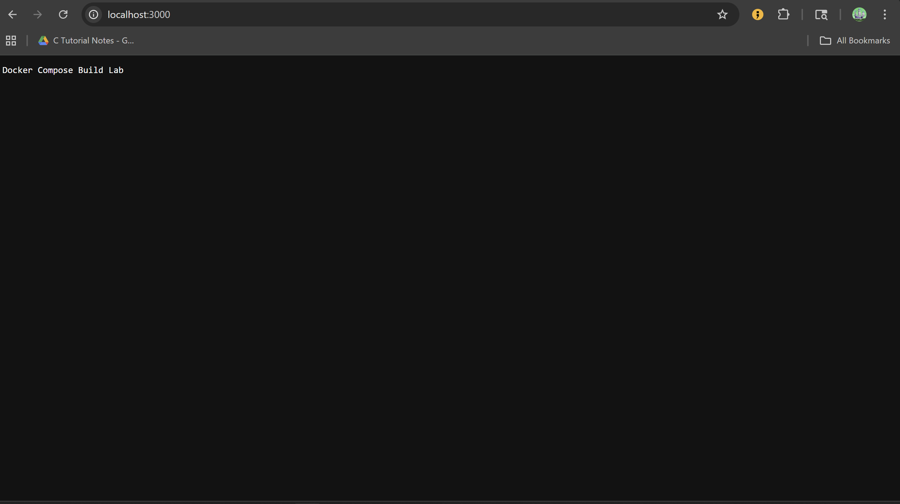

---

# 📊 Key Learnings

- Docker Run is **imperative**
- Docker Compose is **declarative**
- Compose simplifies multi-container apps
- Volumes ensure persistence
- Networks enable communication

---

# 🧾 Conclusion

Docker Compose is more efficient for managing complex applications compared to Docker Run.
